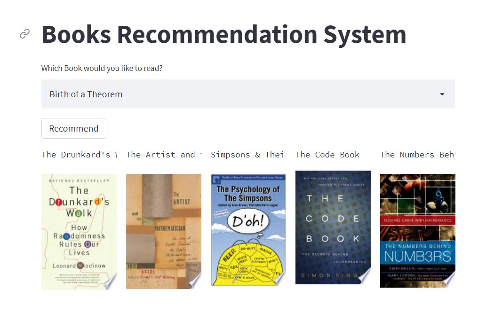

# Book Recommendation (Content Based)

***What is a Recommendation System?***

Recommender systems or Recommendation systems aim to predict users’ interests and recommend product items that quite likely are interesting for them. They are among the most powerful machine learning systems that online retailers implement in order to drive sales.

***There are two primary types of recommender systems:***

***Collaborative Filtering Systems:***  These types of recommender systems are based on the user’s direct behavior. That is, this system builds a model of the user based on past choices, activities, and preferences. It then uses this knowledge to predict what the user will like based on their similarity to other user profiles.

***Content-Based Filtering System:***  Content-based recommender systems, on the other hand, are based on the items, and not necessarily the users. This method builds an understanding of similarity between items. That is, it recommends items that are similar to each other in terms of properties.

There is a ***third*** type of recommender system, known as a ***hybrid*** approach. As you can guess, this approach combines the collaborative and content-based approaches to build better and more generalized systems. That is, it basically combines the strength of both approaches.

## DEMO LINK

kindly find below link for the project DEMO:-

http://54.198.55.159:8501/#books-recommendation-system

## Objective

Recommender systems have become a part of daily life for users of Amazon and Netflix and even social media. While some sites might use these systems to improve the customer experience (if you liked movie A, you might like movie B) or increase sales (customers who bought product C also bought product D), others are focused on customized advertising and suggestive marketing. As a book lover and former book store manager, I have always wondered where I can find good book recommendations that are both personalized to my interests and also capable of introducing me to new authors and genres. The purpose of this project is to create just such a recommender system (RS).
## Project Overview

**Resources:**

Programming language: Python 3.9,

**Packages used:** pandas, numpy, Nltk,cosine similarity,pickel,Streamlit,Requests.

**Project goal:**

To build a recommendation system that will recommend a user top 5 books of his/her interest.

**Project architecture:**

**Data Gathering:**

**Data Preprocessing:**
 
1)Data cleansing   
2)Nan value treatment     
3)Extraction of relevant featuress

**Word Embedding**

Here i have use **countvectorizer** for word embedding(convert text data into vectors)

**Algorithm Used**

Here, i have used Cosine Similarity Algorithm for find out Similarity between two vectors.

**what is Cosine Similarity??**

Cosine similarity is one of the metric to measure the text-similarity between two documents irrespective of their size in Natural language Processing. A word is represented into a vector form. The text documents are represented in n-dimensional vector space.

## Project Deployment

Project Deployment has been done on AWS Cloud Platform.

kindly find below steps for the same.

Link : https://hersanyagci.medium.com/model-deployment-with-streamlit-on-aws-ec2-f52ab42d7813
## Conclusion

Recommender systems are a powerful new technology for extracting additional value for a business from its user databases. Recommender systems benefit users by enabling them to find items they like. Conversely, they help the business by generating more sales.
